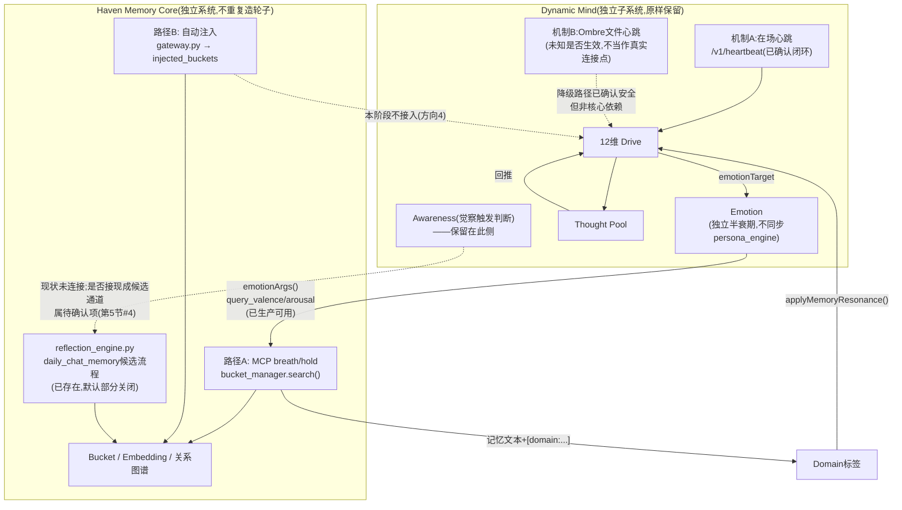

# Memory System 2.0 最终整合前总审阅 —— 动态心智整合边界 v2(定稿输入)

**状态:总审阅结论,供 Phase 2 Architecture Lock / ADR 使用,本身不是 ADR,不是实施方案。**
**本文档不含代码,未修改任何代码、架构、Haven 文件、审计文件(00-18)或设计文件 v1。**

依据:`docs/audit/phase0-1.5/00_baseline_lock.md` 至 `18_heartbeat_source_audit.md` 全部 19 份审计文件,以及 `docs/design/dynamic_mind_integration_proposal_v1.md`。本文档只做事实收束,不重新猜测、不补充新证据。

**已确定方向(用户给定,本文档据此收束,不重新评估)**:
1. Dynamic Mind 的 12维 Drive + Emotion + ThoughtPool + 自主循环作为拟整合核心
2. 不采用 Haven 现有 `persona_engine.py` 的情绪系统
3. 不重复建设 Haven 已有的 Memory Core / Recall / Reflection 能力
4. 不接入自动注入路径B,除非后续单独决定
5. 不因心潮念原项目停止更新而扩大迁移范围

---

## 0. 与既有报告的冲突点(优先说明,以最新直接代码证据为准)

| 冲突 | 早期报告的说法 | 最新证据 | 处理方式 |
|---|---|---|---|
| **"心跳依赖"是一个机制还是两个** | 15/16/17号报告(含设计提案v1)把"心跳"当作单一概念讨论,笼统评估其脆弱性 | 18号报告逐行拆出**两个完全独立、互不调用**的机制:机制A(`/v1/heartbeat`,心潮自己的在场心跳,写入方已确认)、机制B(`/memory-data/heartbeat.json` 的 Ombre 文件心跳,写入方未找到)。18号是最新、最直接的代码证据,**以18号为准** |
| **Haven 是否已有等价自我觉察机制** | 15号报告(仅读 `reflection_engine.py` 前260行)标注"未验证";我在上一轮对话中曾据此推测"Haven没有这个功能" | 17号报告**全文4364行通读**,确认 `daily_chat_memory` 是与 `awareness.js` 高度对应的候选→(可选)确认→写Bucket三段式机制,**已接入生产调度**,只是默认配置关闭(`daily_chat_memory_mode=off`) | **以17号为准**:Haven 确实已有该类能力,此前"Haven没有"的说法不成立 |
| **状态持久化最佳落点** | 设计提案v1把这列为"待决策14",未给出倾向 | 17号新发现 `persona_engine.py` 是语义最接近的候选,但其读-改-写**完全无锁**,并发安全性反而弱于心潮念现状 | **以17号为准**:在 Haven 补上并发防护之前,不建议迁移,倾向"保留现状" |

---

## 1. 最终保留:心潮念 Dynamic Mind 进入 Memory System 2.0 的机制

| 机制 | 说明 | 状态 |
|---|---|---|
| 12维 Drive 系统 | `DIMENSIONS`/`DRIVE_KEYS`/`DRIVE_GROWTH_COUPLINGS`(15号报告1-9节) | 已确认,核心 |
| Emotion(valence/arousal 半衰期) | `emotionTarget`/`settleEmotion`,独立运行,**不与 `persona_engine.py` 同步**(呼应方向2) | 已确认,核心 |
| Thought Pool | 闪念→执念晋升/回推(15号报告) | 已确认,核心 |
| 自主唤醒心跳循环框架 | `server.js` 15分钟定时器 + 结算/做梦/自主念头/白天浮现分支的**整体调度框架** | 已确认,核心 |
| ├─ 机制A:在场心跳 | `POST /v1/heartbeat`,由 Claude Code hook 或 `xinchao_event` 触发,刷新心潮自身 `lastHeartbeatAt`,与 Ombre/Haven 无关 | **已确认**,是心潮自身运行的必需部分,原样保留 |
| └─ 机制B:Ombre文件心跳 | `/memory-data/heartbeat.json`,`readOmbreHeartbeat()` | **未知是否生效**(18号穷尽5仓库未找到写入方,compose无共享卷)。保留其现有的静默降级代码(不改代码),但**不应再被当作"确定生效的外部信号"来设计**,见第5节 |
| Memory Resonance(Memory→Drive方向) | `parseSurfacedDomains→applyMemoryResonance→写回state.drives` | 已确认,生产运行(16号) |
| Drive→Memory 现有窄通道 | `emotionTarget→settleEmotion→emotionArgs→query_valence/arousal→Haven bucket_manager.search路径A的_calc_emotion_score` | 已确认,生产运行,**仅限路径A**(16号) |
| 状态持久化维持 `state.json` 方案 | 不迁移到 Haven 的 SQLite 基础设施 | 已确认(17号新证据支持:Haven侧最接近的 `persona_engine.py` 并发安全性更弱,当前迁移无益) |

---

## 2. 最终放弃:明确不迁移的机制及原因

| 机制 | 不迁移原因 | 状态 |
|---|---|---|
| 同步/接入 Haven `persona_engine.py` 情绪系统 | 用户已定方向2;两套情绪系统结构类似(半衰期公式数学形式一致)但驱动方式不同(确定性 vs LLM评估),保持独立、不互相依赖 | 已确认 |
| 新建 Drive→Recall 结构化加权接口(修改 `bucket_manager.py`) | 现有 `emotionArgs()`→`query_valence`/`query_arousal` 通道已是功能等效、改动为零的现成路径,没有必要新建(16号) | 已确认 |
| 接入自动注入路径B(`gateway.py`) | 用户已定方向4;16号已确认路径B不接受任何 emotion/drive 参数,当前明确排除 | 已确认 |
| `cabin-store.js`(小屋留言/记账)、Bark推送、OAuth/Dashboard 等外围功能 | 15号已分类为外围,与动态心智核心机制在数据和调用两层面均无耦合 | 已确认 |
| 重复搭建 Haven 已有的候选池/自我觉察写入基础设施 | 用户已定方向3;17号已确认 Haven `reflection_engine.py` 的 `daily_chat_memory`(候选→JSON暂存→confirm→写Bucket)已是**真实接线的生产能力**,只是默认关闭,不是"Haven没有";若 Dynamic Mind 未来需要"觉察到的事沉淀为记忆"这个出口,**不应在 Haven 侧另建一套平行的候选写入通道** | 已确认(方向已定,具体怎么接是待确认项,见第5节) |
| 移植 `awareness.js` 的候选写入逻辑本身(而非其"何时该觉察"的触发判断) | Haven 的 `memory_write_gate.py` 两级阈值机制、`reflection_engine.py` 的 `daily_chat_memory` 三段式流程均已比 `awareness.js` 更成熟,不需要照搬其写入判定 | 已确认 |
| 恢复/强化 `withDriveHint` 式自然语言驱力标签传递 | 16号已确认这条路径正被心潮念自身2026-09-07的提交边缘化(仅剩窄场景兜底调用),不因心潮念原项目停更而扩大迁移范围(用户已定方向5),维持现状即可,不主动强化 | 已确认 |

**注**:「触发判断」与「写入通道」要分开——`awareness.js` 基于 drive/emotion 轨迹的统计规则(何时该觉察)是心潮念独有能力,**保留在 Dynamic Mind 一侧**(见第1节);只是它最终"沉淀成记忆"这一步,不需要在 Haven 侧另建一套,应优先考虑接现成的 `reflection_engine.py` 候选机制——但具体怎么接、要不要接,是接口设计问题,不在本次总审阅范围内决定(见第5节)。

---

## 3. Haven 保留:继续作为 Memory Core,不重复造轮子

| 能力 | 说明 |
|---|---|
| Bucket / Embedding / 语义检索 | `embedding_engine.py`/`bucket_manager.py` 既有生产能力,不需要 Dynamic Mind 重建 |
| 路径A:MCP `breath` 工具检索 | `bucket_manager.search()`,含 `query_valence`/`query_arousal` 情绪加权(权重2.0),是 Dynamic Mind **目前唯一真实触达 Haven 记忆的通道** |
| 路径B:`gateway.py` 自动注入 | 已确认生产运行,本阶段**不接入**,与 Dynamic Mind 保持独立(呼应方向4) |
| `reflection_engine.py` 的候选生成基础设施 | `daily_chat_memory`(候选→确认→写Bucket)、`reflect()`(关系天气,无需确认直接写)、日记萃取(无需确认直接写)——**均已确认存在且部分已生产接线**,不需要 Dynamic Mind 重复建设(呼应方向3) |
| `memory_write_gate.py` 两级阈值候选写入 | `pending_threshold`/`grow_threshold`,已确认比 `awareness.js` 的固定阈值更成熟 |
| `memory_edges.py`/`entity_edges.py` 关系图谱 | `confidence`+`reason`+`relation_type`(含 contradicts/supports/evidenced_by),是现有最接近 Claim-Evidence 结构的载体,不需要另建 |

---

## 4. 两者连接点

### 目前真实存在(已确认,生产可用)

- **Drive→Memory**:`emotionArgs()`→`query_valence`/`query_arousal`→路径A的 `_calc_emotion_score` 加权
- **Memory→Drive**:`parseSurfacedDomains()`→`applyMemoryResonance()`/`surfacedDriveKey()`→写回 `state.drives`
- **协议层**:Dynamic Mind 作为 MCP 客户端,调用 Haven(Ombre)暴露的 `breath`/`hold` 工具(路径A)
- **`withDriveHint`**:存在但范围极窄(仅睡眠做梦材料退化兜底分支),且正被心潮念自身边缘化,不建议作为"确定生效的连接点"来设计

### 明确不接(现状如此,或用户已定方向排除)

- **路径B(`gateway.py` 自动注入)**:代码上不接受任何 drive/emotion 参数;方向4明确排除,除非后续单独决定
- **`persona_engine.py` 情绪状态**:方向2明确排除,不同步
- **`reflection_engine.py` 的候选写入通道**:目前 Dynamic Mind 没有任何代码调用它(17号已确认 `gateway.py`/`bucket_manager.py` 不引用 `reflection_engine`),这是**现状事实**,不是"决定不接"——若未来要接,需要新设计接口,属于第5节的待确认项
- **机制B(Ombre文件心跳)**:18号已确认在审计到的仓库范围内找不到写入方、找不到共享卷,**不应被当作 Dynamic Mind 与 Haven 之间的真实连接点**,即使代码里读取逻辑存在

---

## 5. 仍需人工确认(只列真正会阻塞实施的事项)

| # | 事项 | 为什么会阻塞 |
|---|---|---|
| 1 | **生产环境实际连接的是哪一份 Ombre/Haven 代码?** ——本次深度审计(16/17/18号)锁定的是独立仓库 `haven-ombre`;但 `xinchao-nian` 内嵌了另一份结构完全不同的 `ombre-brain` 微内核版副本(VERSION 2.6.5)。如果生产环境实际部署/连接的是这份内嵌副本而非 `haven-ombre`,那么16号关于路径A/路径B、`bucket_manager.py` 的 `query_valence`/`query_arousal` 等结论**未必直接适用于生产实际连接对象** | 直接决定第3、4节的结论是否对生产环境成立,是唯一可能让"两者连接点"整体结论打问号的项,应最优先确认 |
| 2 | **机制B(Ombre文件心跳)在生产环境的真实文件系统状态**——`/memory-data/heartbeat.json`(或 `OMBRE_HEARTBEAT_FILE` 指向的实际路径)是否存在、内容是否合法、修改时间是否新鲜,这不在源码审计能力范围内 | 决定第1节里机制B该按"外部遗留依赖(从未生效)"还是"确实生效但审计未覆盖到写入方"来对待,进而影响是否需要在整合设计里剥离对它的依赖 |
| 3 | **`xinchao-dynamic-mind` 若采用 2.4.0 以外版本(如2.7.0或更新),许可证已是 AGPL-3.0**——强 Copyleft,是否影响能否自由整合其代码/思路进 Memory System 2.0 而不触发己方代码的开源义务,需法务裁决(13/14号已多次标注,仍未解决) | 直接限定"最终保留"清单里各机制**允许以何种方式(思路/代码)迁移**的合法边界,若不确认可能导致整合范围本身违反许可证 |
| 4 | **若决定打通"自我觉察→记忆"这条线,`daily_chat_memory` 的限流参数取谁的**——Haven默认10条/天+语义相似度去重+无时间过期;心潮念 `awareness.js` 是1条/天+7天窗口去重+14天过期,理念差异大 | 这是产品行为决策,不确定会阻塞该功能的最终形态是否可用,但**不阻塞其他机制的整合**,可延后到具体设计该功能时再定 |

**不列入本表的**(普通技术债,不阻塞 Phase 2 启动,可在实施阶段随手处理或延后):`persona_engine.py` 缺锁(已决定不用它,不影响本次整合)、机制B的未来时间戳无校验、`compose.yaml` 镜像tag不同步等。

---

## 6. 最终架构边界图

---

## 7. Phase 2 可以开始的条件

**已具备,可以先行规划的部分**:
- 12维 Drive / Emotion / ThoughtPool / 自主唤醒框架 / 现有 Memory↔Drive 双向通道(路径A范围内)的机制边界已经审计清楚,且**不需要任何 Haven 代码改动**即可独立运作——这部分可以先从"Dynamic Mind 作为独立子系统继续运行、只用现有 MCP breath/hold 接口"这个最小范围开始做实施细节规划。

**进入 Phase 2 正式 Architecture Lock 前,应先有答案的**(对应第5节):
1. 生产环境实际连接的 Ombre/Haven 代码版本(独立 `haven-ombre` 还是 `xinchao-nian` 内嵌的微内核版 `ombre-brain`)——**必须**先确认,否则第3、4节结论的适用性存疑
2. 机制B心跳文件在生产环境的真实存在状态——**必须**先确认,否则"保留原样"的前提假设不明
3. 许可证决策——**仅当**计划采用 2.4.0 以外版本的心潮念代码/仓库时才阻塞
4. `daily_chat_memory` 限流参数取舍——**仅当**计划本阶段就打通"自我觉察→记忆"这条线时才阻塞,否则可延后

第1、2项是通用阻塞项,建议优先解决;第3、4项是条件阻塞项,取决于实施范围是否触及对应功能。**一旦第1、2项有明确答案,即可认为 Phase 0–1.5 的证据基础已经充分,可以进入 Phase 2 做正式的 Architecture Lock / ADR。**

---

*本文档为总审阅结论,供人工在 Phase 2 决策时使用。所有"最终保留/放弃"判断均基于 00–18 号已有审计证据,未新增猜测,未做产品决策,未修改任何代码。*
