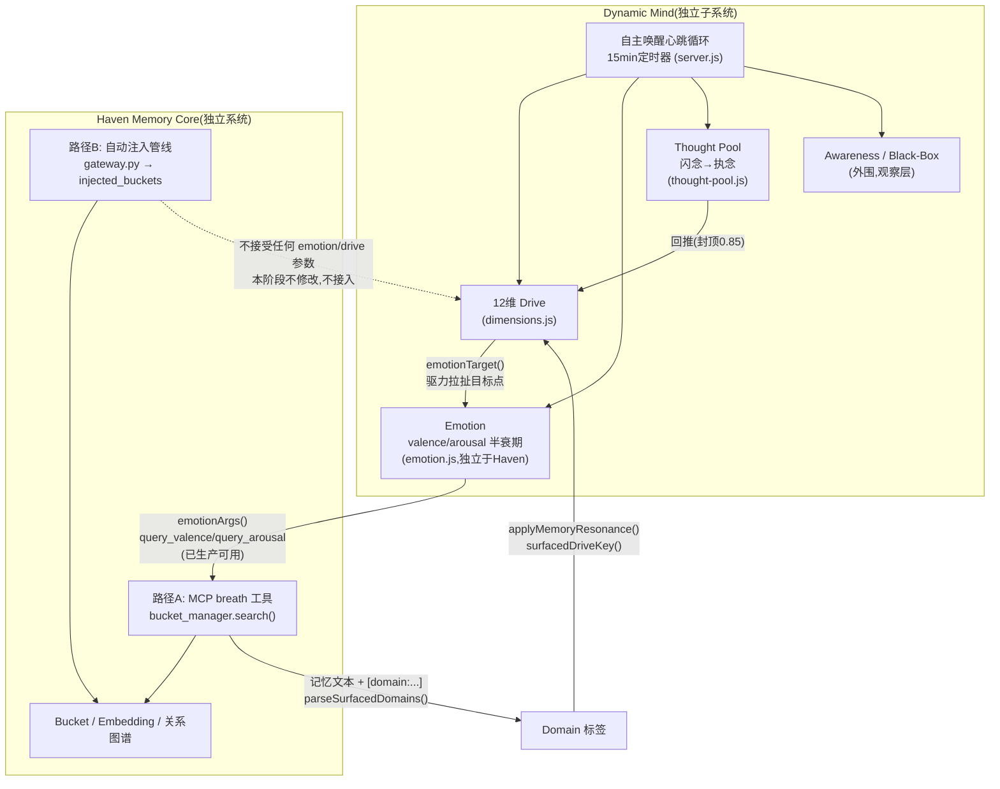

# 动态心智整合方案 v1(草案)

**状态:设计提案草案,不是已批准的 ADR,不是 Phase 2 Architecture Lock。**
**本文档不含任何实现代码,未修改任何生产代码、Haven Recall、Haven Injection、数据库或表结构。**

依据:`docs/audit/phase0-1.5/15_xinchao_nian_dynamic_mind_3.3.6_audit.md`(心潮念3.3.6九模块深度审计)、`16_dynamic_mind_memory_integration_audit.md`(Drive×Haven Recall/Injection交叉点审计)。本文档在两份审计已确认的证据基础上做架构综合,新增的一条关键推导(第5节)已重新核实源码,证据见下。

---

## 0. 目标回顾

把心潮念 3.3.6 的 **12维Drive + Emotion + Thought Pool + 自主唤醒 + Memory Resonance** 整合进 Memory System 2.0,同时:

1. 12维 Drive 作为核心动态心智机制保留
2. 不采用 Haven 现有的 LLM 情绪机制(`persona_engine.py`)
3. 明确 Dynamic Mind 与 Haven Memory Core 的边界
4. 明确 Memory→Drive(已存在)与未来 Drive→Memory(现状)的接口方向
5. 自动注入(`gateway.py`)暂不修改,Haven Recall(`bucket_manager.py`)暂不修改
6. 只做架构方案,不写代码、不改代码

---

## 1. 核心设计原则

**Dynamic Mind 是一个独立子系统,不是 Haven 的一部分。** 它拥有自己的状态、自己的心跳循环、自己的持久化,能够完全脱离 Haven 单独运行(16号报告已确认心潮念不硬编码依赖 xinchao-nian 或其他外部仓库,唯一硬性前置条件是 `SERVICE_TOKEN`)。它与 Haven 的**唯一**交互面是既有的 MCP 工具协议(`breath`/`hold` 等)——Dynamic Mind 是 MCP 客户端,Haven(Ombre)是 MCP 服务端。**没有共享数据库,没有共享进程,没有共享内存状态。**

情绪系统完全内部化:Dynamic Mind 用自己的 `emotion.js` 式确定性半衰期算法计算 valence/arousal,**不读取、不写入、不同步** Haven 的 `persona_engine.py`。两套情绪系统各自独立运行、互不干扰,这样不会出现"两个真理来源"的冲突(呼应此前多轮审计里反复出现的"第二份同类系统"风险模式)。

Drive→Memory 和 Memory→Drive 两个方向**都不新建接口**——16号审计发现两条方向事实上都已经存在于现有代码里,本方案只是明确认定它们、圈定其边界,不做任何代码改动(详见第5节)。

---

## 2. 保留 / 移植 / 放弃 / 待决策

### 保留(原样作为 Dynamic Mind 核心,来自心潮念自身代码)

| # | 机制 | 来源 |
|---|---|---|
| 1 | 12维 Drive 系统(`DIMENSIONS`/`DRIVE_KEYS`/`DRIVE_GROWTH_COUPLINGS`) | `dimensions.js` |
| 2 | Emotion 确定性半衰期系统(`emotionTarget`/`settleEmotion`/`applyEmotionImpulse`/`emotionLabel`) | `emotion.js`,**不使用**Haven `persona_engine.py` |
| 3 | Thought Pool(闪念→执念晋升/回推) | `thought-pool.js` |
| 4 | 自主唤醒心跳循环(15分钟定时器→结算→做梦/自主念头/白天浮现分支) | `server.js:1505` `runCycle()` |
| 5 | Memory Resonance 现有方向(Memory→Domain→Drive) | `ombre-client.js`/`engine.js` |
| 6 | Drive→Memory 现有通道(`emotionArgs`→`query_valence`/`query_arousal`→Haven路径A) | 见第5节,**已生产可用,不新建** |

心跳循环当前依赖外部 OB 心跳文件判断"清醒"这一现状(16号报告已指出的设计特点)本阶段**不改变**,保留原样。

### 移植(设计模式,仍在 Dynamic Mind 自己的代码域内,不触碰 Haven)

| # | 机制 | 说明 |
|---|---|---|
| 7 | "状态明显偏离才触发动作"的门槛模式(参照 `emotion.js` 的 `STAMP_MIN_DEVIATION`) | 供 Dynamic Mind 自己判断何时把状态变化视为"值得记录",不涉及修改 Haven |
| 8 | `DOMAIN_AFFINITY` "多域取max不累加+最小亲和度门槛"的防自激设计模式 | 已是心潮念自身机制,原样沿用,不是新移植 |

### 放弃(明确不做,及理由)

| # | 项目 | 理由 |
|---|---|---|
| 9 | 同步/接入 Haven `persona_engine.py` 的 LLM 情绪系统 | 违反要求2;两套情绪系统独立运行,不双向同步 |
| 10 | 新建"Drive→Recall Weight Modifier"式结构化加权接口(15号报告曾提议) | 需要改 `bucket_manager.py`,触碰要求5;现有 `emotionArgs` 通道已是功能等效、改动更小的版本,没必要另建 |
| 11 | 接入 `gateway.py` 自动注入路径(路径B) | 需要改 Haven 生产代码,明确排除在本阶段之外(要求5) |
| 12 | 移植 `cabin-store.js`(小屋留言/记账)、Bark 推送、OAuth/Dashboard 等外围功能 | 与动态心智核心机制无关,15号报告已归类为"外围",不在本次整合范围 |
| 13 | 移植"记忆写入决策候选池"式机制(`awareness.js` 的候选→确认流程) | Haven 的 `memory_write_gate.py` 已有更成熟的两级阈值机制(15号报告已确认),暂不重复引入 |

### 待决策(需要人工或后续审计再定,本阶段不预设答案)

| # | 问题 | 现状处理 |
|---|---|---|
| 14 | Dynamic Mind 状态持久化物理位置:继续用自己的 `state.json` 文件,还是迁移/双写进 Haven 现有存储(如 `gateway_state.db`)? | 暂按"保留原样、独立文件存储"处理 |
| 15 | 自主唤醒的"清醒"判定依赖外部心跳文件(而非真实对话事件)这一设计是否要改? | 暂不处理,15/16号报告已记录该脆弱性 |
| 16 | 是否要恢复/强化 `withDriveHint` 式的显式驱力标签传递(目前正被心潮念自身2026-09-07的改动边缘化)? | 暂不作为本阶段架构变更,留待产品判断 |
| 17 | 未来若要让 Drive 影响自动注入(路径B),需要 Haven 方决定是否开放对应接口 | 跨系统协作决策,不由本文档单方面裁定 |
| 18 | `reflection_engine.py`(4364行)全文未审计,是否已有等价的自我觉察机制? | 待安排后续专项审计,避免重复造轮子 |

---

## 3. Dynamic Mind 与 Haven Memory Core 的边界

| | Dynamic Mind | Haven Memory Core |
|---|---|---|
| 定位 | 独立心智状态机子系统 | 独立记忆存储/检索基础设施 |
| 拥有的状态 | `state.json`(drives/emotion/thoughtPool/awareness等)、`black-box.json` | Bucket(Markdown)、`embeddings.db`、`gateway_state.db`、`memory_edges.jsonl` 等 |
| 运行方式 | 自己的15分钟心跳定时器(`server.js`) | 由 MCP 工具调用/HTTP 请求驱动,无独立心跳循环 |
| 是否可独立运行 | 是(唯一前置条件是 `SERVICE_TOKEN`) | 是(当前已在生产运行) |
| 与对方的交互面 | 作为 MCP **客户端**调用 `breath`/`hold` 等工具 | 作为 MCP **服务端**响应工具调用 |
| 共享资源 | **无**——不共享数据库、不共享进程、不共享内存状态 | 同左 |

---

## 4. Memory→Drive 与 Drive→Memory 接口方向

### Memory→Drive(已确认,已生产运行)

```
Ombre breath 返回记忆文本(自带 [domain:...] 标签)
  → parseSurfacedDomains()          [ombre-client.js:383]
  → applyMemoryResonance() / surfacedDriveKey()   [engine.js:750 / 256]
  → 写回 state.drives
```
单向,方向明确,16号报告已逐行追踪确认。

### Drive→Memory(已确认,已生产运行,但范围窄——本节是本次设计综合的关键发现)

```
state.drives
  → emotionTarget(drives)                          [emotion.js:101]
     (12维驱力按 DRIVE_PULL 权重拉扯出情绪目标点)
  → settleEmotion(state, elapsedHours, {drives})    [emotion.js:148, 调用方 engine.js:466]
     (每15分钟半衰期回落,逼近目标点)
  → emotionArgs(emotion) 打包 {valence, arousal}    [ombre-client.js]
  → 作为参数随每次 breath/breath_advanced 调用发出   [ombre-client.js: recentMaterialWithRefs / daytimeMaterialWithRefs / thoughtMaterialWithRefs]
  → Haven bucket_manager.search() 接收 query_valence/query_arousal   [bucket_manager.py:717-718]
  → _calc_emotion_score() 加权(权重2.0)              [bucket_manager.py:1207,764-765]
  → 影响 MCP 路径A(breath 工具)的检索排序
```

**这条链路已经存在、已经在生产运行,不需要设计新接口**——本方案的结论是**明确认定它就是当前的 Drive→Memory 通道**,不新建代码。

**局限(必须明确写清楚,不能含糊)**:
- 只影响 **路径A**(MCP `breath` 工具检索,`bucket_manager.search()`)
- **完全不触达路径B**(`gateway.py` 自动注入管线,写入 `injected_buckets` 表那条)——16号报告已确认 `gateway.py` 不接受任何 emotion/drive 参数
- 传递的是"情绪坐标"(2个数字),不是"驱力标签"(`withDriveHint` 式的自然语言提示词已被心潮念自身在 2026-09-07 的提交里边缘化,仅剩一个窄场景兜底调用)

---

## 5. 最终模块关系图



**图中要点**:
- Dynamic Mind 内部形成 Drive↔Emotion↔ThoughtPool 的闭环,完全在自己代码域内运行
- 与 Haven 的连接**只有两条已存在的线**:Emotion→路径A(Drive→Memory)、路径A→Domain→Drive(Memory→Drive)
- 路径B(自动注入)与 Dynamic Mind **没有任何连接**(图中用虚线标出"不接入"),这是本阶段刻意维持的空白,不是遗漏

---

## 6. 与用户六项要求的对照

| 要求 | 落实方式 |
|---|---|
| 1. 12维Drive作为核心保留 | 第2节"保留"表第1项 |
| 2. 不采用Haven现有LLM情绪机制 | 第1节明确情绪系统内部化、不同步;第2节"放弃"表第9项 |
| 3. 明确Dynamic Mind与Haven边界 | 第3节 |
| 4. 明确Memory→Drive与Drive→Memory方向 | 第4节 |
| 5. 自动注入/Haven Recall暂不修改 | 第2节"放弃"表第10、11项;图中路径B显式不接入 |
| 6. 只做架构方案,不写代码 | 全文无实现代码,已验证的仅为既有代码事实引用 |

---

*本文档为设计提案草案,供人工审阅。任何据此的代码改动、依赖新增、数据库变更均需另行经过人工批准的实施阶段。*
